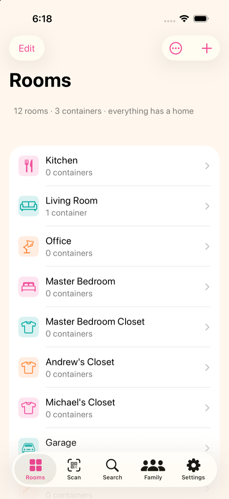
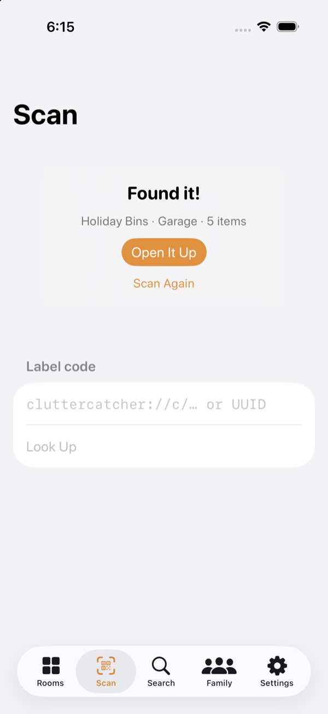
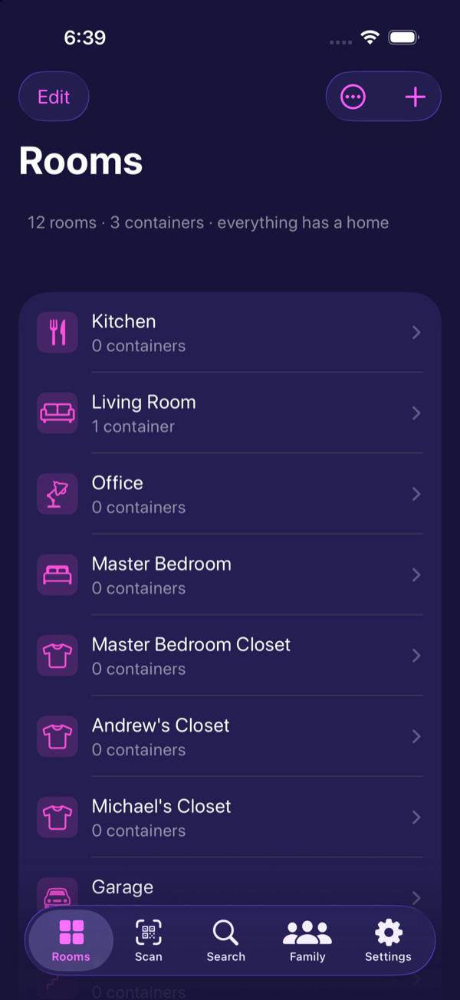
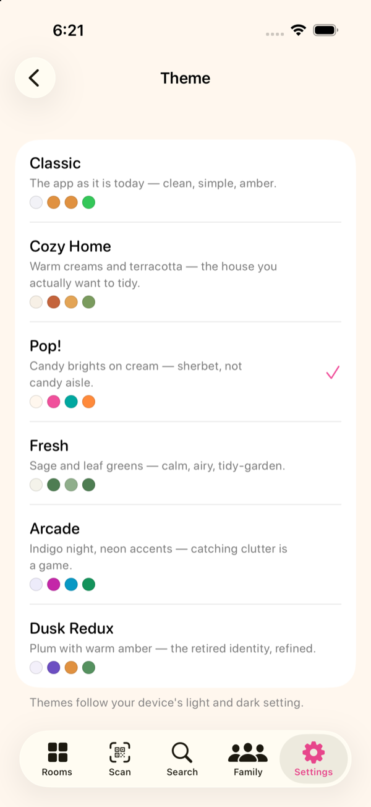
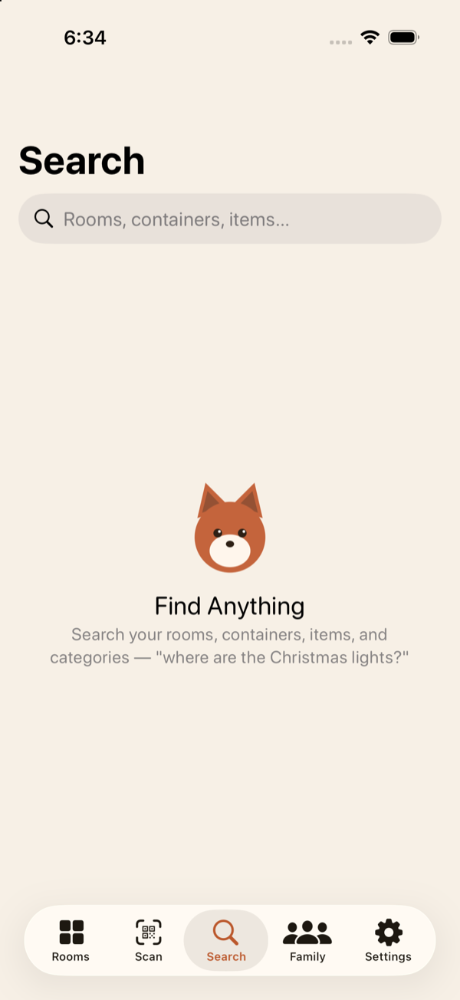
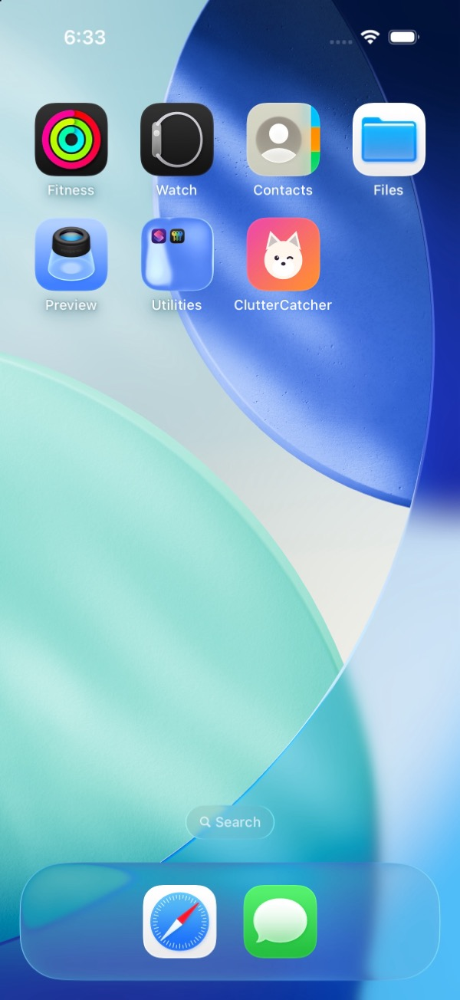

# ClutterCatcher

A whole-home storage catalog for one family: QR labels on bins, drawers, and
shelves that resolve to what's inside. Scan the sticker on a box in the
garage, see the box's contents before you open it. Native SwiftUI, CloudKit
household sync, built with care.

<p align="center">
  
  
  
</p>
<p align="center">
  
  
  
</p>

## What it does

- **Rooms → Containers → Items**, with categories as an orthogonal tag
  system. Live search across everything, item photos with container covers.
- **QR labels.** Every container's UUID doubles as its QR payload
  (`cluttercatcher://c/<uuid>`). Print Avery-style label sheets (5163/5160
  presets, start-at-any-cell for partially used sheets), scan with the
  camera or the in-app scanner, and deep-link straight to the container.
- **Household sync.** One CloudKit zone, shared with the family via a
  zone-wide CKShare. CKSyncEngine underneath; last-write-wins conflicts with
  **user-visible receipts** (Settings → Sync Activity) — nothing is ever
  lost silently. Fully functional offline and signed out.
- **Make It Yours.** Six themes (Classic, Cozy Home, Pop!, Fresh, Arcade,
  Dusk Redux), each light + dark, each with its own motion personality —
  from Cozy's slow-honey settles to Pop!'s confetti to Arcade's glow and
  score-tick. Six matching app icons. Theme and icon are per-device,
  per-person: everyone in the family picks their own, and the choice never
  syncs. Fen, the marsh fox mascot, appears where the theme wants him —
  drawn entirely in SwiftUI shapes, blink and all. Reduce Motion collapses
  every flourish to a plain fade.

The theme system was designed by Shelley — the design brief was
"sherbet, not candy aisle."

## Architecture notes

- SwiftUI, Swift 6 strict concurrency, deployment target iOS 26.
- GRDB/SQLite on disk (`DatabasePool`, WAL). Row identity: uppercase UUID
  TEXT primary keys that double as CKRecord recordNames and QR payloads.
- Two write paths that never mix: **LocalMutation** (stamps `updated_at`,
  enqueues the change, same transaction) vs **ServerApply** (applies server
  rows verbatim, no restamp, no echo). Sync state is rebuilt from the
  durable queue, so nothing depends on in-memory engine state surviving.
- Themes are plain values over one skeleton: every theme fills the same
  token roles above the untouched Liquid Glass substrate, so six themes cost
  one implementation. Zero sync surface by construction *and* by test.
- The decision log is real: `OPEN_ITEMS.md` records every implementation
  decision (DL1+) with rationale, and `planning/` holds the milestone plans.

## Status

**M4 in progress** — themes (M4a) and motion personality (M4b) are merged
and running on family devices; the milestone closes after the offline
conflict script, a one-week parallel-use soak, and sign-off. Complete so
far: the full local app (M0/M1), private-zone CloudKit sync (M2), zone-wide
sharing with owner/participant roles and onboarding (M3), item photos with
CKAsset sync, HEIC, and cache GC (M6-photos/M6.1). Next: onboarding the
kids (M5), then hardening + iPad (M6). The authoritative plan lives in
`planning/ccv4-plan.md`.

## Toolchain

- Xcode 27 beta daily driver, **deployment target iOS 26.0** (API ≤ iOS 26).
- [XcodeGen](https://github.com/yonaskolb/XcodeGen): `project.yml` is the
  source of truth. Never edit the `.xcodeproj` — it's gitignored; regenerate.
- Swift 6 language mode, strict concurrency. GRDB 7 via SPM.

## Building

```sh
brew install xcodegen                     # once
export DEVELOPER_DIR=/Applications/Xcode-beta.app/Contents/Developer  # optional (D4)
scripts/build.sh                          # xcodegen generate + simulator build
scripts/test.sh                           # full test suite
scripts/ui-smoke.sh                       # boot sim, install, screenshot; set CONTAINER_UUID to test deep links
```

`SIM_NAME` overrides the default simulator (`iPhone 17`).

Note: syncing requires your own Apple Developer team and CloudKit container
(`project.yml` → bundle id, team, entitlements); the app runs fully local
without one.

## Layout

```
planning/          plan + per-run implementation plans
ClutterCatcher/    app sources — App/ Data/ Features/ Design/ Shared/
ClutterCatcherTests/
design/            theme reference canvases, icon sources, Fen geometry
docs/screenshots/  the images above
scripts/           build / test / ui-smoke
OPEN_ITEMS.md      decision log + Questions for Owen
```

## License

GPL-3.0 — see [LICENSE](LICENSE).
